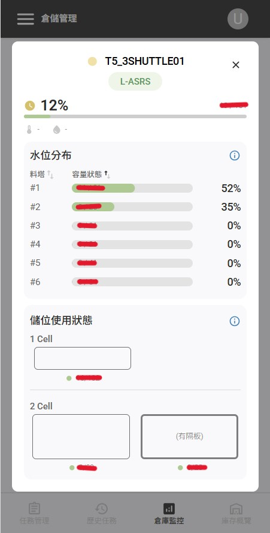
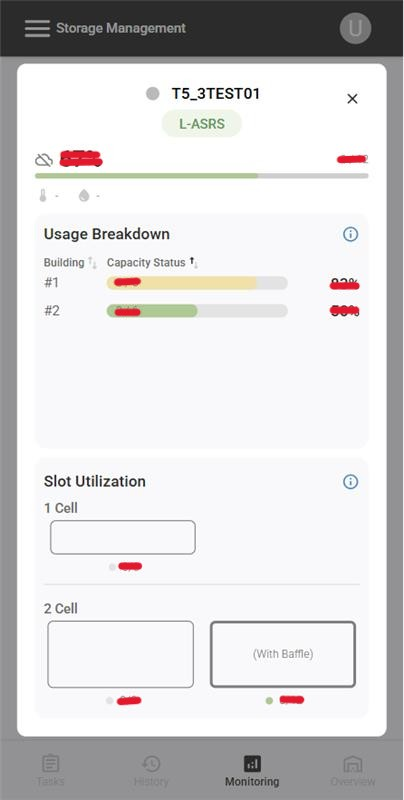
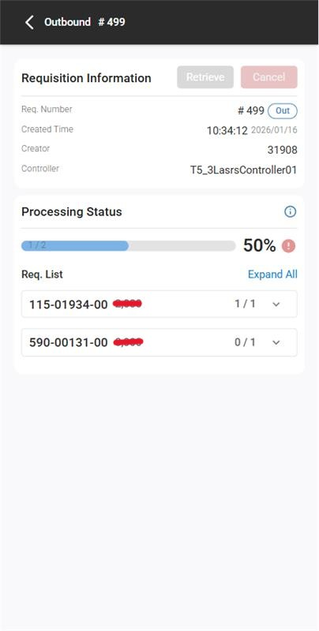
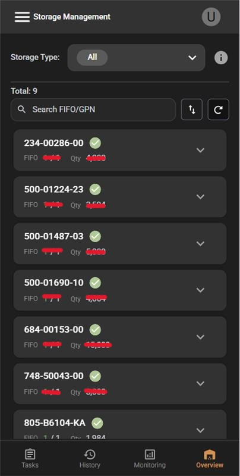
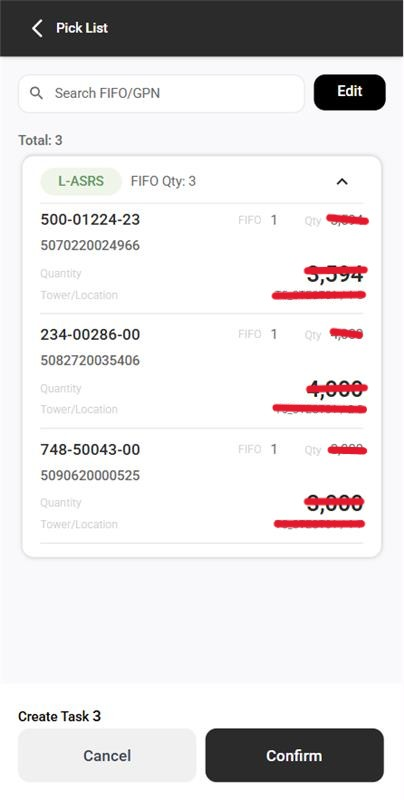
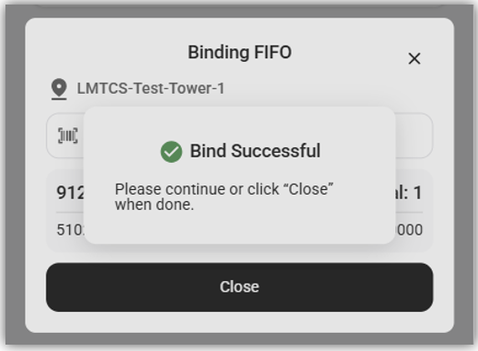
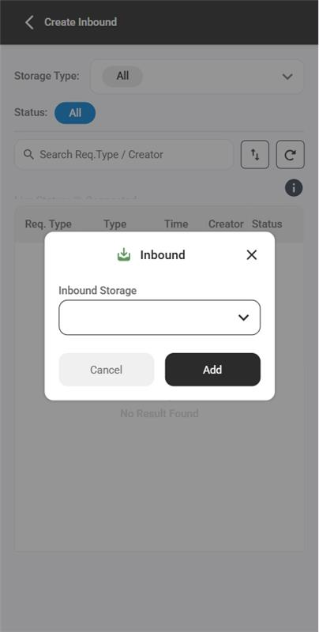
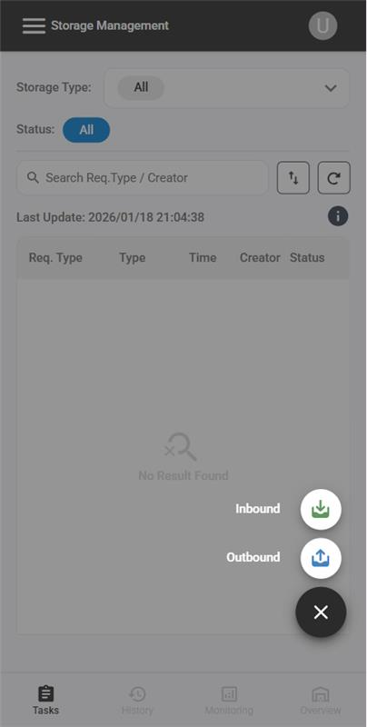
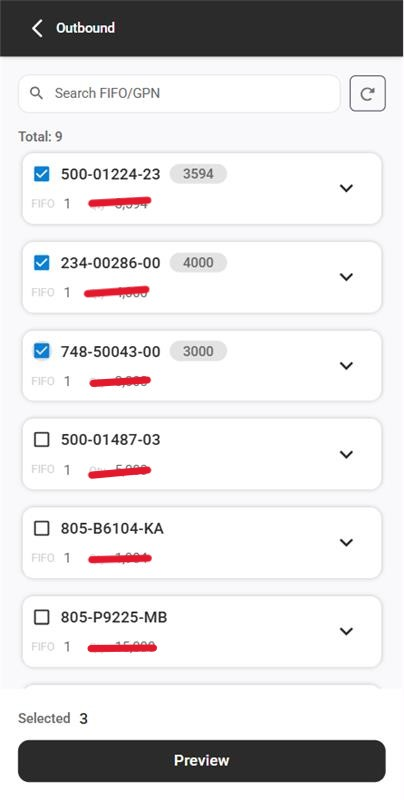

## Tower Monitoring

.jpg>)
.jpg>)
-2.jpg>)
.jpg>)

## Tower Information

.jpg>)
.jpg>)

## Task Information

.png>)
.jpg>)

## Task Management

.jpg>)
.jpg>)

## Pick List

## Lasrs

.jpg>)
.jpg>)
.jpg>)

## Inbound

## Direct Request

