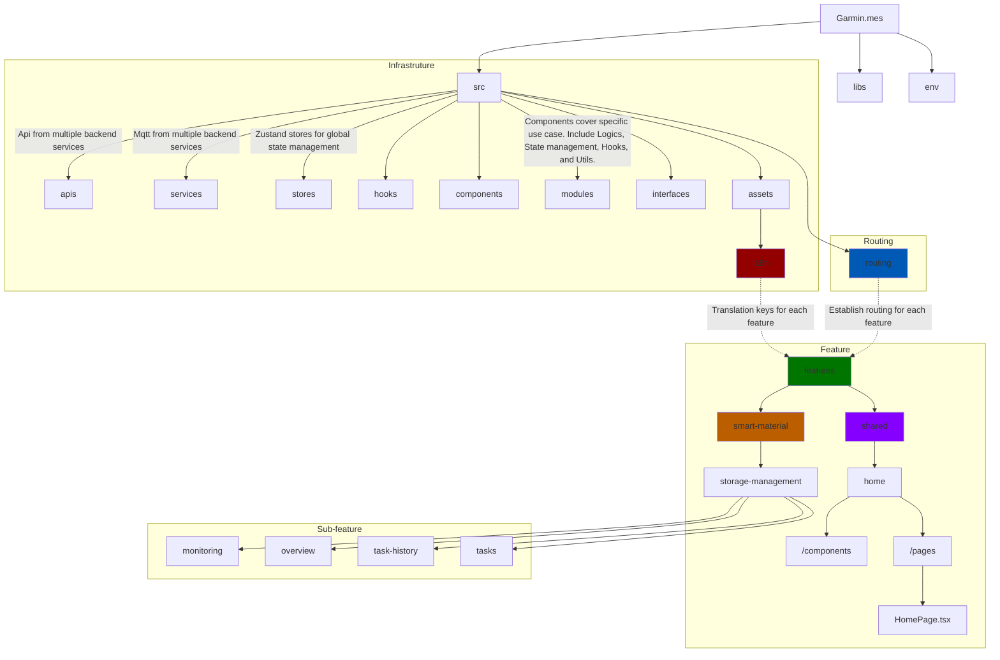

```mermaid
graph TB
root[Garmin.mes]

    root --> src
    root --> libs
    root --> env

    subgraph "Infrastruture"
    src --> |"Api from multiple backend services"| apis
    src --> |"Mqtt from multiple backend services"| services
    src --> |"Zustand stores for global state management"| stores
    src --> hooks
    src --> components
    src --> |"Components cover specific use case. Include Logics, State management, Hooks, and Utils."| modules
    src --> interfaces
    src --> assets
    assets --> i18n
    end

    i18n -.-> |"Translation keys for each feature"| features

    subgraph "Routing"
    src --> routing
    end

    subgraph "Feature"
    routing -.-> |Establish routing for each feature| features

    features --> shared
    features --> smart-material

    shared --> home
    home --> home-comp["/components"]
    home --> home-pages["/pages"]
    home-pages --> home-pages-compoenent["HomePage.tsx"]

    smart-material --> storage[storage-management]
    end

    subgraph "Sub-feature"
    storage --> monitoring
    storage --> overview
    storage --> task-history
    storage --> tasks
    end

    style routing fill: #005AB5
    style features fill: #007500
    style i18n fill: #930000
    style shared fill: #8600FF
    style smart-material fill: #BB5E00
```
