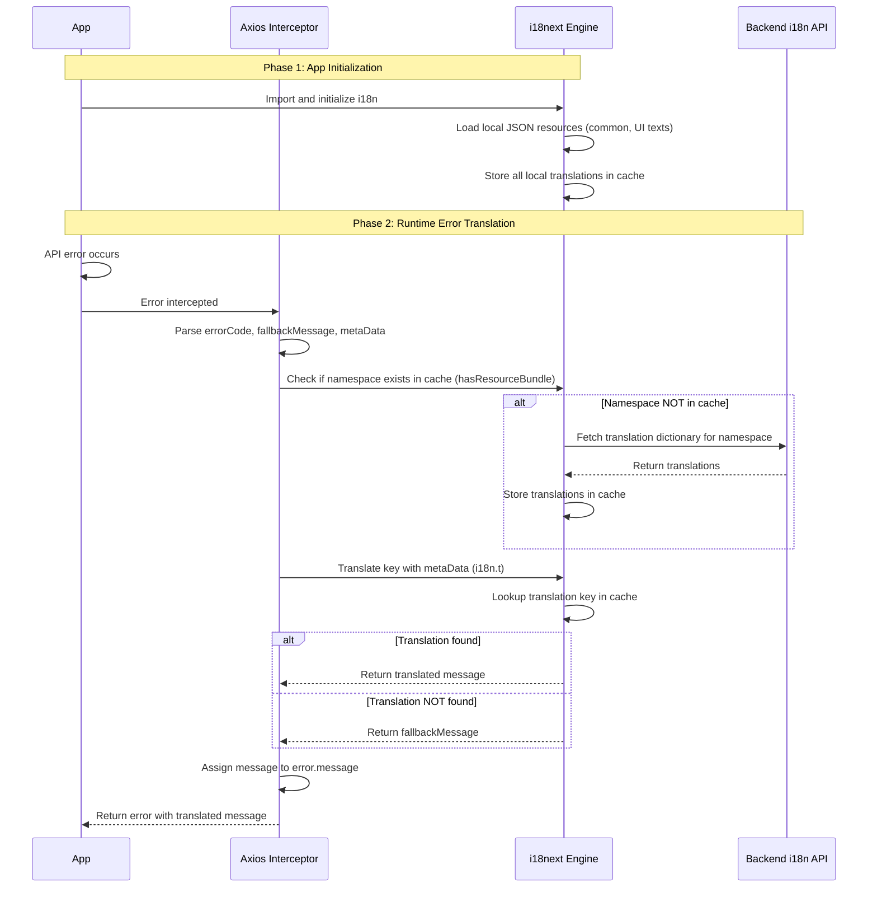

# Internationalization (i18n) Integration Architecture

## Overview

This document describes the internationalization (i18n) integration architecture for the Garmin MES React application. The system combines local JSON-based translation resources with dynamic backend API-driven translations, specifically designed to handle error messages from the MatOne backend service.



### Key Flow Components

1. **Phase 1 - Initialization**: App starts, i18n loads local JSON files and stores in cache
2. **Phase 2 - Error Translation**:
   - Error occurs → Axios Interceptor catches it
   - Interceptor parses error data and coordinates with i18n
   - i18n checks cache → fetches from backend if needed
   - Interceptor receives translated message and returns to App

### Architecture Benefits

- **Simple Two-Phase Design**: Clear separation between initialization and runtime
- **Cache-First Strategy**: Always check cache before external requests
- **Lazy Loading**: Backend translations loaded only when needed
- **Graceful Fallback**: Always provides a message even if translation fails

## Architecture Components

### 1. Core Libraries

The i18n system is built using the following key libraries:

- **i18next**: Core internationalization framework
- **react-i18next**: React bindings for i18next
- **i18next-http-backend**: HTTP backend for loading translations from remote APIs
- **i18next-browser-languagedetector**: Automatic language detection from browser settings

### 2. Configuration Structure

#### i18n Configuration (`src/assets/i18n/i18n.ts`)

```typescript
i18n
.use(HttpApi)
.use(LanguageDetector)
.use(initReactI18next)
.init({
resources, // Local bundled resources
partialBundledLanguages: true,
backend: {
loadPath: `${environment.i18nUrl}/MatOne/{{lng}}`,
},
cache: {
enabled: true,
expirationTime: 7 _ 24 _ 60 _ 60 _ 1000, // 7 days
},
fallbackLng: "en",
supportedLngs: ["en", "zh-Hant"],
debug: false,
interpolation: {
escapeValue: false,
},
defaultNS: "translation",
ns: [
"prepAssist",
"smartShelf",
"smartFinder",
"settings",
"home",
"login",
"storageManagement",
"agv",
"binding",
"common",
"pickList",
"taskInfo",
"mft",
"smartSchedule",
"materialReturn",
"smt288",
],
});
```

#### Resource Persistence

Once a translation dictionary is loaded from the backend i18n service, it is permanently stored in the i18next engine for the current session:

```typescript
// In interceptors.ts - ensureNamespaceAndTranslate function
i18n.addResourceBundle(i18n.language, ns, extractedContent, true, true);
```

**Key Characteristics:**

- **Session Persistence**: Translations remain available throughout the browser session
- **No Re-fetching**: Subsequent errors with the same namespace use cached translations
- **Memory Efficiency**: Only loaded namespaces consume memory, not all possible namespaces
- **Language Specific**: Resources are stored per language (e.g., `zh-Hant`, `en`)

**Example Flow:**

1. First API error with "MatOne.WFC_PASS_SHEET_NOT_FOUND" → Load MatOne dictionary
2. Dictionary stored: i18n.services.resourceStore.data['zh-Hant']['MatOne']
3. Second API error with "MatOne.ANOTHER_ERROR" → Use existing MatOne dictionary
4. No additional backend requests needed for same namespace

#### Key Configuration Parameters

| Parameter                   | Value               | Description                                         |
| --------------------------- | ------------------- | --------------------------------------------------- |
| `partialBundledLanguages`   | `true`              | Allows mixing bundled and backend-loaded namespaces |
| `fallbackLng`               | `'en'`              | Default fallback language                           |
| `supportedLngs`             | `['en', 'zh-Hant']` | Supported languages                                 |
| `defaultNS`                 | `'translation'`     | Default namespace (not actively used)               |
| `cache.enabled`             | `true`              | Enable caching for backend resources                |
| `cache.expirationTime`      | `7 days`            | Cache expiration time                               |
| `interpolation.escapeValue` | `false`             | Disable HTML escaping for React                     |

### 3. Resource Structure

#### Local Resources

Local translations are organized in JSON files under `src/assets/i18n/locales/`:

#### Backend Resources

Dynamic translations are loaded from the MatOne backend API:

- **URL Pattern**: https://shixpa-peproxy00.garmin.com/i18n/api/MatOne/{language}
- **Response Format**: {"MatOne": {"KEY": "translated value"}}
- **Supported Languages**: `en`, zh-Hant

### 4. Environment Configuration

#### Environment Variables

The i18n URL is configured through environment variables:

bash

# .env.local and other environment files

#### Environment Loader (`src/environments/environment.loader.ts`)

```typescript
export const env = {
  i18nUrl: import.meta.env.VITE_I18N_URL,
  // ... other environment variables
};

export const environment = {
  i18nUrl: env.i18nUrl,
  // ... other environment variables
};
```

### 5. API Error Handling Integration

#### Axios Interceptor (`src/api/interceptors.ts`)

The system integrates i18n with API error handling through axios interceptors:

```typescript
// Global error interceptor
axios.interceptors.response.use(
  (response) => response,
  async (error) => {
    if (error.response?.data) {
      const data = error.response.data as BaseApiErrorResponse;
      const { errorCode, fallbackMessage, metaData } = data;

      if (errorCode) {
        const translatedMessage = await ensureNamespaceAndTranslate(
          errorCode,
          fallbackMessage,
          metaData,
        );
        error.message = translatedMessage;
      }
    }
    return Promise.reject(error);
  },
);
```

#### Error Response Interface (`src/interfaces/api.interface.ts`)

```typescript
export interface BaseApiErrorResponse {
  errorCode?: string; // Format: "namespace.key" (e.g., "MatOne.WFC_PASS_SHEET_NOT_FOUND")
  fallbackMessage?: string; // Fallback message if translation fails
  metaData?: Record<string, any>; // Interpolation parameters
}
```

#### Namespace Loading Logic

```typescript
const ensureNamespaceAndTranslate = async (
  errorCode: string,
  fallbackMessage: string,
  metaData?: Record<string, unknown>,
): Promise<string> => {
  const [ns] = errorCode.split('.');

  // Check if namespace is loaded
  let hasResource = i18n.hasResourceBundle(i18n.language, ns);

  if (!hasResource) {
    // Load namespace from backend if not available
    try {
      await i18n.loadNamespaces(ns);
      hasResource = i18n.hasResourceBundle(i18n.language, ns);
    } catch (err) {
      return fallbackMessage;
    }
  }

  // Handle backend response format transformation
  if (hasResource) {
    const resourceBundle = i18n.getResourceBundle(i18n.language, ns);
    if (
      resourceBundle &&
      typeof resourceBundle === 'object' &&
      resourceBundle[ns]
    ) {
      // Transform {"MatOne": {...}} to {...}
      const extractedContent = resourceBundle[ns];
      i18n.addResourceBundle(i18n.language, ns, extractedContent, true, true);
    }
  }

  return translateErrorMessage(errorCode, fallbackMessage, metaData);
};
```

### 6. Caching Strategy

#### Backend Resource Caching

- **Enabled**: cache.enabled: true
- **Expiration**: 7 days
- **Storage**: localStorage
- **Purpose**: Reduce API calls and improve performance

#### Cache Management

```typescript
// Clear cache programmatically
i18n.services.backendConnector.backend.cache.clear();
```

### 7. Performance Optimizations

#### Lazy Loading

- Backend namespaces are loaded only when needed
- Local resources are bundled and available immediately

#### Caching

- Backend responses cached for 7 days
- Reduces API calls and improves user experience

#### Bundle Splitting

- Translation files are separate chunks
- Reduces initial bundle size

### 8. Troubleshooting

#### Common Issues

1. **Translations not loading**
   - Check network connectivity
   - Verify environment variables
   - Check browser console for errors

2. **Wrong language displayed**
   - Clear localStorage: localStorage.removeItem('i18nextLng')
   - Check language detection order
