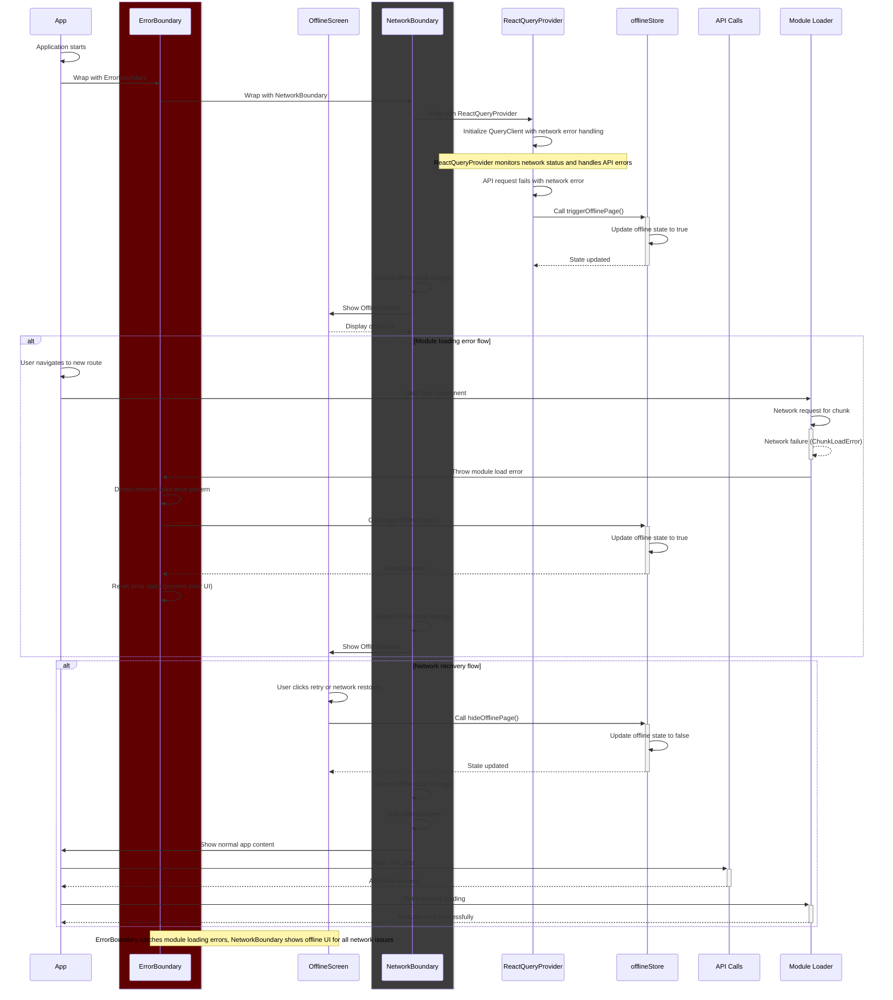

```mermaid
sequenceDiagram
participant app as App
box rgb(96, 0, 0)
participant errorBoundary as ErrorBoundary
end
participant offlineScreen as OfflineScreen
box rgb(60, 60, 60)
participant networkBoundary as NetworkBoundary
end
participant reactQuery as ReactQueryProvider
participant offlineStore as offlineStore
participant api as API Calls
participant moduleLoader as Module Loader

    app ->> app: Application starts
    app ->> errorBoundary: Wrap with ErrorBoundary
    errorBoundary ->> networkBoundary: Wrap with NetworkBoundary
    networkBoundary ->> reactQuery: Wrap with ReactQueryProvider
    reactQuery ->> reactQuery: Initialize QueryClient with network error handling

    note over reactQuery: ReactQueryProvider monitors network status and handles API errors

    reactQuery ->> reactQuery: API request fails with network error
    reactQuery ->>+ offlineStore: Call triggerOfflinePage()
    offlineStore ->> offlineStore: Update offline state to true
    offlineStore -->>- reactQuery: State updated
    networkBoundary ->> networkBoundary: Detect offline state change
    networkBoundary ->> offlineScreen: Show OfflineScreen
    offlineScreen -->> networkBoundary: Display offline UI

    alt Module loading error flow
        app ->> app: User navigates to new route
        app ->> moduleLoader: Load lazy component
        moduleLoader ->>+ moduleLoader: Network request for chunk
        moduleLoader -->>- moduleLoader: Network failure (ChunkLoadError)
        moduleLoader ->>+ errorBoundary: Throw module load error
        errorBoundary ->> errorBoundary: Detect network load error pattern
        errorBoundary ->>+ offlineStore: Call triggerOfflinePage()
        offlineStore ->> offlineStore: Update offline state to true
        offlineStore -->>- errorBoundary: State updated
        errorBoundary ->> errorBoundary: Reset error state (prevent error UI)
        networkBoundary ->> networkBoundary: Detect offline state change
        networkBoundary ->> offlineScreen: Show OfflineScreen
    end

    alt Network recovery flow
        offlineScreen ->> offlineScreen: User clicks retry or network restores
        offlineScreen ->>+ offlineStore: Call hideOfflinePage()
        offlineStore ->> offlineStore: Update offline state to false
        offlineStore -->>- offlineScreen: State updated
        networkBoundary ->> networkBoundary: Detect offline state change
        networkBoundary ->> networkBoundary: Hide OfflineScreen
        networkBoundary ->> app: Show normal app content
        app ->>+ api: Retry API calls
        api -->>- app: API calls succeed
        app ->>+ moduleLoader: Retry module loading
        moduleLoader -->>- app: Modules load successfully
    end

    note over errorBoundary,offlineScreen: ErrorBoundary catches module loading errors, NetworkBoundary shows offline UI for all network issues
```
